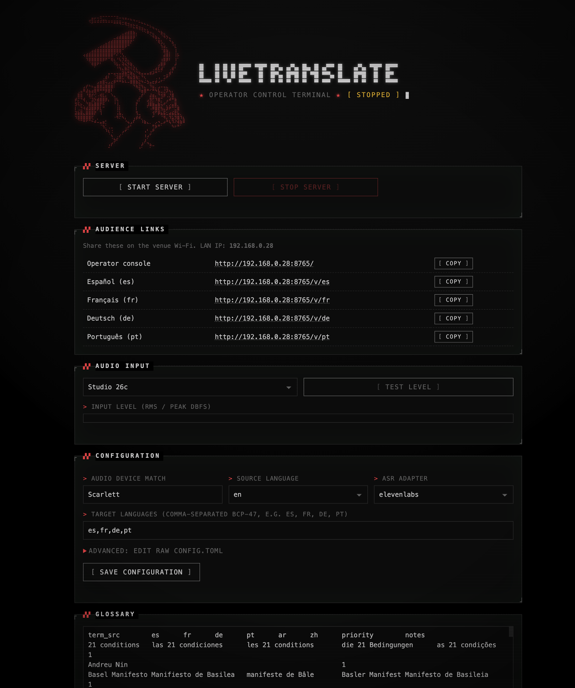

# livetranslate



**livetranslate turns a live talk into subtitles in the audience's own languages, on their own phones.** A presenter speaks; the software listens to the room's audio, writes down what is being said, translates it into several languages, and shows each translation on its own web page. Attendees open a link on the venue Wi-Fi and read along in the language they pick — a few seconds behind the speaker, like live subtitles at a conference.

Under the hood it uses commercial speech-to-text (ElevenLabs, AssemblyAI, or Speechmatics) and an AI translator that is held to a fixed glossary, so names and field-specific terms come out the way you want them.

> **Is this for me?** Running an event needs **one technical person** (the "operator") to set it up and press start — see [What you'll need](#what-youll-need). **Attendees and presenters need nothing but a phone and the link.** If you are that operator and want the plain-language tour first, read [How it works](#how-it-works-plain-language), [How it stays reliable](#built-for-live-events-how-it-stays-reliable), and [Limitations](#limitations--what-to-expect) before the configuration reference.

**Documentation**

| Document | Contents |
|---|---|
| This README | Install, configuration, operator control panel, live runs, test harness |
| [`live-translation-pipeline-spec.md`](live-translation-pipeline-spec.md) | Full design specification — architecture, invariants, failure handling |
| [`docs/vendor-notes.md`](docs/vendor-notes.md) | ElevenLabs / AssemblyAI / Speechmatics API verification notes and open uncertainties |
| [`docs/superpowers/plans/`](docs/superpowers/plans/) | Implementation plans (pipeline, operator control panel) |

---

## How it works (plain language)

Think of it as an assembly line that runs continuously while someone is on stage:

1. **It listens.** The software takes the speaker's audio — ideally a clean feed from the sound desk, not a laptop's built-in mic — in real time.
2. **It writes down what's said.** A speech-to-text service turns the audio into text and groups it into complete sentences. A glossary you prepare beforehand helps it spell names, acronyms, and field-specific jargon correctly.
3. **It translates each sentence.** Every finished sentence is sent to an AI translator, once per target language. The same glossary forces your required wording for key terms (e.g. always render *rate of profit* as *tasa de ganancia* in Spanish), and the translator is given the previous sentence for context so it reads smoothly.
4. **The audience reads along.** Each language has its own web page. Translations appear line by line as the talk proceeds. Attendees just keep the page open; new lines scroll in on their own.

**Optional "instant draft" mode** (Speechmatics only): a fast, rough translation can appear *immediately* in grey italics so the audience never stares at a blank screen, then it is quietly replaced by the polished, glossary-correct translation a moment later. See [Speechmatics (ASR + draft translation)](#speechmatics-asr--draft-translation).

There is nothing to install on attendees' phones — it is an ordinary web page on the local network.

## What you'll need

| You need | Why | Notes |
|---|---|---|
| **One technical operator** | To edit settings, paste in keys, run an audio check, and press start | The [operator control panel](#operator-control-panel-recommended) means they don't need to use a terminal |
| **A clean audio feed** | Transcription quality is only as good as the audio | A line/USB feed from the mixing desk beats an open-room mic; the app refuses to start if it can't find the audio device you named |
| **Reliable internet at the lectern** | Speech-to-text and translation run in the cloud | No internet ⇒ no transcription or translation. Have a backup connection for important events |
| **Venue Wi-Fi for attendees** | Their phones load the reading pages from the operator's machine over the local network | Attendees and the operator's laptop must be on the same network |
| **Paid API accounts** | The cloud services bill per hour of audio and per translation | You supply keys for a speech service (ElevenLabs, AssemblyAI, or Speechmatics) **and** a translation model (e.g. DeepSeek/OpenAI-compatible, or Anthropic). See [Secrets](#secrets--environment-variables-only) |
| **A glossary (recommended)** | So names and jargon are heard and translated correctly | A simple spreadsheet of terms; the control panel can even draft one from the speaker's notes |

Source audio must be in **English or German** (chosen per event). Translations are available into **Spanish, French, German, Portuguese, Arabic, and Chinese**.

---

## Built for live events: how it stays reliable

A talk doesn't pause for a software hiccup, so the system is designed to keep going and to fail quietly rather than visibly:

- **It reconnects itself.** If the connection to the speech service drops, it automatically reconnects (backing off and retrying), and **replays the last couple of seconds of audio** from a short rolling buffer so words spoken during the blip aren't lost.
- **It can switch providers mid-talk.** You can configure a *failover* speech service; if the primary one keeps failing, the system moves to the backup on its own.
- **It survives a crash.** Every sentence and translation is written to disk as it happens. If the program (or the laptop) dies, `--resume` rebuilds the displays exactly as they were and continues.
- **One slow language can't stall the rest.** Each language is translated on its own track. If one translation is slow or a request fails, the others keep flowing, and the affected line shows a brief "translation unavailable" placeholder instead of freezing the whole show.
- **A watchdog watches the watchers.** A health monitor flags stalls, and long sessions can rotate their connection proactively before hitting a provider's time limit.
- **The audience display behaves itself.** New lines scroll in automatically, but if a reader scrolls up to re-read something, the page won't yank them back down — a "jump to live" button appears instead.
- **It won't start mis-configured.** If the named audio device isn't present, the app refuses to start (so you never broadcast silence from the wrong input), and configuration edits are validated before they're saved.
- **Your keys stay local.** API keys live only in environment variables / a local file, never in the shareable config, and the operator control panel is reachable only from the operator's own machine.

None of this removes the need for a dry run — but it means a momentary network wobble or a single bad translation is a ripple, not a blackout.

## Limitations & what to expect

Be honest with your audience about what this is and isn't:

- **It's machine translation, not a human interpreter.** It's fast and usually fluent, but it can miss nuance, humour, or idiom. The glossary keeps *your key terms* correct; it can't guarantee perfect phrasing everywhere.
- **It runs a few seconds behind.** Expect roughly a few seconds of delay (target: about 4 seconds typical, up to ~7 at peak). The optional draft mode makes something appear almost instantly, but that first version is approximate until the polished one replaces it.
- **It depends on the cloud.** Speech-to-text and translation are online services. No internet means no captions, and the services **cost money per hour of audio** and per translation — budget for it.
- **Audio quality is everything.** Strong accents, crosstalk, heavy background noise, or rapid switching between languages will degrade accuracy. A clean feed from the sound desk matters far more than any setting.
- **Fixed language set.** Source audio is English or German only; translation targets are the six listed above. (With Speechmatics' instant-draft mode on, at most five target languages at once, and **Arabic is not available as a Speechmatics draft target** — it still works through the main LLM translator.)
- **Text only.** Attendees *read* the translation — there is no spoken/audio output.
- **It needs a competent operator and setup time.** The control panel removes the terminal, but someone still has to configure audio, paste keys, load the glossary, and test before doors open. It is not a plug-and-play appliance.
- **Speechmatics is the default speech service.** Its realtime wire format has been **validated against a live key** (2026-06-25): transcription, timestamps, and translation (including Chinese as `cmn`) all confirmed; ElevenLabs is configured as the automatic failover. As always, run the pre-event dry run with your own key. See [`docs/vendor-notes.md`](docs/vendor-notes.md).

The [pre-event checklist](#pre-event-checklist-spec-10-m7) below walks through the dry run that catches most of these before they reach the audience.

---

## Install

**Requirements:** Python ≥ 3.11, ffmpeg (harness only).

```sh
python3 -m venv .venv
.venv/bin/pip install -e '.[harness,dev]'

# harness only — needed for FileSource (ffmpeg) and bakeoff (jiwer):
brew install ffmpeg
```

---

## Configuration

Edit `config.toml` before each event. All secrets go in environment variables only — never in config files or logs.

### Sections

| Section | Key settings |
|---|---|
| `[session]` | `source_language` — pin to `"en"` or `"de"` per event; `output_dir` — session JSONL root |
| `[audio]` | `device_substring` — substring of the audio interface name (app refuses to start if not matched); `chunk_ms` — feed size (default 100) |
| `[asr]` | `adapter` — `"elevenlabs"`, `"assemblyai"`, or `"speechmatics"` (**default `"speechmatics"`**); `failover` — second adapter to switch to when the primary stays down (**default `"elevenlabs"`**); `give_up_after_s` — seconds the primary may keep failing before failover (default `30`; `0` = never); `overlap_ms` — replay overlap on reconnect |
| `[asr.elevenlabs]` | `keyterms_max = 50` — ElevenLabs realtime cap (surcharged at $0.05/hr extra; count logged at startup) |
| `[asr.assemblyai]` | `use_domain_prompt` — pass `domain_blurb.txt` as a free-form transcription hint (u3-rt-pro only) |
| `[asr.speechmatics]` | `additional_vocab_max = 50` — glossary terms injected as custom vocabulary (large lists incur a latency penalty; see `docs/vendor-notes.md`); `max_delay = 1.0` — seconds before partials are emitted (lower = faster but more revisions) |
| `[display]` | `draft_translation = false` — when `true` (Speechmatics adapter only), shows an instant italic draft caption from Speechmatics' bundled realtime translation, replaced by the glossary-accurate LLM translation when it lands |
| `[segmenter]` | `max_words = 45`, `max_pending_s = 12` — sentence finalization thresholds |
| `[translate]` | `targets` — list of BCP-47 codes (default `["es","fr","de","pt"]`; add `"ar"`, `"zh"` to enable; **max 5 when Speechmatics `draft_translation` is on, and `"ar"` is not allowed in that mode** — Speechmatics can't translate to Arabic); `provider`, `base_url`, `model` — **must be set before translation works** (see below); `timeout_s`, `batch_threshold`, `batch_max` |
| `[glossary]` | `path = "glossary.tsv"`, `domain_blurb = "domain_blurb.txt"` |
| `[display]` | `host = "0.0.0.0"`, `port = 8080`, `font_scale = 1.6` |
| `[health]` | `stall_s = 10` — seconds before the watchdog flags a stall |
| `[harness]` | `rtf = 1.0` — playback rate for FileSource (do not raise above 1.0 without vendor confirmation) |

### Speechmatics (ASR + draft translation)

Speechmatics is the **default primary** ASR adapter, with ElevenLabs configured as the automatic failover. This is the shipped configuration:

```toml
[asr]
adapter         = "speechmatics"
failover        = "elevenlabs"   # ResilientASR switches to this if the primary stays down
give_up_after_s = 30             # seconds of failed reconnects before failing over (0 = never)
```

To run ElevenLabs (or AssemblyAI) as primary instead, just set `adapter` accordingly; both remain fully supported.

**API key** — add to the gitignored `.env` (or pass as an environment variable):

```dotenv
SPEECHMATICS_API_KEY=<your key>
```

**Endpoint** — the adapter connects to the EU realtime endpoint:
`wss://eu.rt.speechmatics.com/v2/`

**Custom vocabulary** — glossary terms are injected as Speechmatics `additional_vocab` entries (up to `additional_vocab_max = 50`). Large lists incur a latency and memory penalty; see `docs/vendor-notes.md` (Speechmatics section) for details. Terms beyond the cap are logged and dropped from ASR boosting (still enforced in translation via the glossary block).

**Instant draft-translation layer** — Speechmatics' bundled realtime translation can surface a fast italic draft caption while the glossary-accurate LLM translation is in flight. Enable it:

```toml
[display]
draft_translation = true   # Speechmatics adapter only; no effect with elevenlabs/assemblyai
```

When enabled, each audience display shows the Speechmatics translation immediately as an italic draft line; it is replaced (without flicker) by the final LLM translation once it arrives. Set `draft_translation = false` (the default) to suppress it and show only final translations.

> **Target-language limits:** Speechmatics' realtime translation accepts at most **5** target languages, and **does not support Arabic (`ar`)** as a target. With `draft_translation = true` on the Speechmatics adapter, `translate.targets` is forwarded to its `translation_config`, so the list must have ≤ 5 entries and contain no `"ar"` — `load_config` rejects either. The LLM translator itself has no such limits, so all 6 supported targets (including `ar`) are fine when `draft_translation = false` (or with another adapter).

**Wire format** — the Speechmatics realtime schema was **live-validated against a real `SPEECHMATICS_API_KEY` on 2026-06-25** (message names, second-based timestamps, and the translation payload — Chinese returns as `cmn`). As with any provider, re-confirm with your own key during the pre-event dry run. See `docs/vendor-notes.md` (Speechmatics section) for the captured details.

### Setting the translation provider

`translate.provider` selects the request/response mapping. Set exactly one before running:

```toml
[translate]
provider  = "openai_chat"              # DeepSeek is OpenAI-compatible
base_url  = "https://api.deepseek.com"
model     = "deepseek-v4-flash"
```

### Secrets — environment variables only

| Variable | Used by |
|---|---|
| `ELEVENLABS_API_KEY` | ElevenLabs adapter (live run + harness) |
| `ASSEMBLYAI_API_KEY` | AssemblyAI adapter (harness bakeoff/chaos) |
| `SPEECHMATICS_API_KEY` | Speechmatics adapter (live run + harness) |
| `TRANSLATE_API_KEY` | LLM translator (all modes with translation enabled) |

### Glossary format

`glossary.tsv` — tab-separated, one term per row:

```
term_src  es  fr  de  pt  ar  zh  priority  notes
rate of profit  tasa de ganancia  taux de profit  Profitrate  ...  1
```

Columns `ar` and `zh` may be empty. `priority 1` terms are loaded first into the keyterm list; terms beyond `keyterms_max = 50` are logged and dropped from ASR boosting (still enforced in translation via glossary block).

---

## Operator control panel (recommended)

A local web app for the technical operator — no terminal needed.

**Start it:** double-click `Start LiveTranslate.command` (Mac) or
`Start LiveTranslate.bat` (Windows). First run creates the Python
environment automatically (needs Python ≥ 3.11 installed). Your browser
opens `http://127.0.0.1:8766/`.

From the panel you can:

- **Edit configuration** — common fields (audio device match, source
  language, adapter, target languages) or the raw `config.toml`
  (validated before save; comments preserved).
- **Edit the glossary** — as an editable table showing only the configured
  target-language columns (raw TSV behind an "advanced" toggle); validated
  with the real loader; shows term and keyterm counts against the
  ElevenLabs cap of 50.
- **Generate glossary from notes** — upload speaker notes or an abstract
  (PDF or plain text) and the configured translate LLM (DeepSeek by
  default) drafts terms for the active target languages. Drafted rows are
  merged *under* the existing glossary (hand-edited rows always win) and
  land in the table unsaved, for review — nothing touches `glossary.tsv`
  until you press save.
- **Manage API keys** — writes `.env`; existing keys shown masked
  (last 4 chars), never echoed in full.
- **Check audio** — list input devices (the one matching
  `audio.device_substring` is flagged) and run a live RMS/peak level
  meter before going live. The meter is released automatically when the
  pipeline starts.
- **Launch / stop the server** — runs `python -m livetranslate` as a
  child process; SIGINT/CTRL_BREAK drain so sessions close cleanly;
  live log tail in the panel.
- **Share audience links** — operator console and per-language URLs
  built on the machine's Wi-Fi/LAN IP, with copy buttons; the operator
  console is embedded in the panel while running.

The control panel binds to **localhost only** (it can read and write API
keys). The display server it launches binds `0.0.0.0:<display.port>` as
before, so the audience links work for anyone on the venue network.

---

## Live run

```sh
ELEVENLABS_API_KEY=<key> TRANSLATE_API_KEY=<key> \
  .venv/bin/python -m livetranslate --config config.toml
```

Optional flags:

| Flag | Effect |
|---|---|
| `--resume sessions/<dir>` | Resume a crashed session; rebuilds displays byte-identical |
| `--log-level DEBUG` | Verbose logging (default: INFO) |

### Saved transcripts

During a run, every sentence and translation is written live to `sessions/<timestamp>/` as append-only JSONL (used by `--resume`). When the session ends, a **human-readable transcript** is also exported to `transcripts/session-N/` (numbered `session-1`, `session-2`, …) — one plain-text file per language, one sentence per line:

```
transcripts/session-1/
  english.txt      # the original transcript (named after [session].source_language)
  spanish.txt      # one file per translate.targets language
  french.txt
  ...
```

Lines stay aligned across languages by sentence; if a sentence had no successful translation, that line reads `[no translation]`. The `transcripts/` folder is gitignored.

### Display URLs (served at `[display] host:port`)

| URL | Audience |
|---|---|
| `http://<host>:8080/` | Operator console — source text, health, per-language lag |
| `http://<host>:8080/v/es` | Spanish reading display |
| `http://<host>:8080/v/fr` | French reading display |
| `http://<host>:8080/v/de` | German reading display |
| `http://<host>:8080/v/pt` | Portuguese reading display |

Add `/v/<lang>` for any language in `translate.targets`. Arabic (`ar`) renders RTL automatically.

---

## Harness

All harness commands require API keys for the adapter being tested. `--no-display` suppresses the HTTP server (recommended in harness runs).

### run_file — end-to-end file test

```sh
ELEVENLABS_API_KEY=<key> TRANSLATE_API_KEY=<key> \
  .venv/bin/python -m harness.run_file \
    --config config.toml \
    --audio recordings/talk1.mp3 \
    --ref refs/talk1.txt \
    --adapter elevenlabs \
    --langs es,fr,de,pt \
    --rtf 1.0 \
    --loop 1 \
    --no-display
```

| Flag | Notes |
|---|---|
| `--audio` | One or more audio files (space-separated); any container ffmpeg can decode |
| `--ref` | Reference transcript for WER/jargon-recall metrics (optional; omit to skip metrics) |
| `--adapter` | `speechmatics`, `elevenlabs`, or `assemblyai` (overrides `config.toml`); defaults to config value |
| `--langs` | Comma-separated target languages (overrides `translate.targets`) |
| `--rtf` | Playback rate (overrides `harness.rtf`; keep at 1.0) |
| `--loop N` | Repeat the audio N times (soak: use `--loop 4` on a 30-min file to reach ~2 h) |
| `--no-display` | Skip the HTTP display server |

Outputs written to `sessions/<timestamp>/`:
- `sentences.jsonl`, `translations.jsonl`, `events.jsonl` — append-only session state
- `report.json` — WER, jargon recall, latency percentiles (p50/p95)
- `report.md` — human-readable source/target table for translation adequacy review

### chaos — reconnect resilience test

Requires `ELEVENLABS_API_KEY` (uses the adapter from config).

```sh
ELEVENLABS_API_KEY=<key> TRANSLATE_API_KEY=<key> \
  .venv/bin/python -m harness.chaos \
    --config config.toml \
    --audio recordings/talk1.mp3 \
    --cuts-ms 30000,95000,150500
```

`--cuts-ms` is a comma-separated list of stream offsets (ms) at which the WebSocket is forcibly closed. The script asserts: reconnect count ≥ number of cuts, zero duplicate finalized sentences.

### bakeoff — compare both adapters

Requires both `ELEVENLABS_API_KEY` and `ASSEMBLYAI_API_KEY`.

```sh
ELEVENLABS_API_KEY=<key> ASSEMBLYAI_API_KEY=<key> TRANSLATE_API_KEY=<key> \
  .venv/bin/python -m harness.bakeoff \
    --config config.toml \
    --audio recordings/talk1.mp3 \
    --ref refs/talk1.txt \
    --langs es,fr,de,pt
```

Runs `elevenlabs` then `assemblyai` sequentially on the same input and emits:
- `bakeoff.csv` — WER, jargon recall, latency p50/p95, reconnects per adapter
- Markdown table printed to stdout

**Decision rule** (spec §8): prefer ElevenLabs unless AssemblyAI wins jargon recall by ≥ 3 points or WER by ≥ 1.5 points absolute, or recordings show heavy DE/EN code-switching that ElevenLabs visibly fumbles.

### soak — 2-hour stability test

```sh
ELEVENLABS_API_KEY=<key> TRANSLATE_API_KEY=<key> \
  .venv/bin/python -m harness.run_file \
    --config config.toml \
    --audio recordings/talk1.mp3 recordings/talk2.mp3 \
    --loop 4 \
    --no-display
```

Pass criteria: zero unrecovered disconnects, zero dead threads, RSS growth < 150 MB between minute 10 and end, invariants hold.

---

## Tests

No API keys needed. The full test suite runs offline using fixtures.

```sh
.venv/bin/python -m pytest tests/ -q
```

---

## Pre-event checklist (spec §10 M7)

Run through this the day before the event and again in the room before doors open.

- [ ] **Audio device:** `audio.device_substring` in `config.toml` matches the mixing-desk interface name. Start the app; it logs the matched device and refuses to start if not found.
- [ ] **Glossary loaded:** startup log shows term count (e.g. `glossary loaded: 42 terms`). Confirm the count matches expectation.
- [ ] **Keyterm count:** startup log shows keyterm count injected into the ASR adapter. Must be ≤ 50 for ElevenLabs realtime (terms beyond the cap are dropped from ASR boosting and logged as a warning). Surcharged at $0.05/hr extra — confirm billing is expected.
- [ ] **End-to-end language test:** run a short recording through `run_file` for all enabled languages and review `report.md` for translation adequacy and glossary term rendering.

  ```sh
  ELEVENLABS_API_KEY=<key> TRANSLATE_API_KEY=<key> \
    .venv/bin/python -m harness.run_file \
      --config config.toml \
      --audio recordings/sample.mp3 \
      --langs es,fr,de,pt \
      --no-display
  ```

- [ ] **Display URLs:** open every display URL in a browser and confirm the SSE stream is live:
  - `http://<host>:8080/` (operator console)
  - `http://<host>:8080/v/es`, `/v/fr`, `/v/de`, `/v/pt` (one per enabled language)

---

## Manual acceptance criteria (spec §9)

| # | Criterion | Automated? | Notes |
|---|---|---|---|
| 1 | Jargon recall ≥ 90% (keyterms enabled; show uplift vs keyterms-off) | Partial — `report.json` computes it | Needs owner recordings + `ELEVENLABS_API_KEY` |
| 2 | Latency p50 ≤ 4 s, p95 ≤ 7 s at rtf=1.0 | Partial — `report.json` `audio_end_to_translation` field (requires a harness run; field is absent for live sessions) | Needs real recordings + live keys |
| 3 | Chaos test passes at 3 cut offsets including one mid-sentence | Yes — `harness/chaos.py` asserts this | Needs `ELEVENLABS_API_KEY` |
| 4 | 2-hour soak passes (zero unrecovered disconnects, RSS growth < 150 MB) | Partial — invariant checks run; RSS monitored manually | Needs 2 h of recordings + live keys |
| 5 | `--resume` after `kill -9` restores displays byte-identical | Covered by unit tests for Store + resume path | Full live validation needs a live session |
| 6 | Operator console reflects forced disconnect within 5 s and shows recovery | Covered by watchdog unit tests + status SSE streaming (error-level StatusEvents now stream level/message to the banner in real time) | Live validation: pull the network cable and observe `/` |
| 7 | Bakeoff report generated for both adapters on same inputs | Yes — `harness/bakeoff.py` + `bakeoff.csv` | Needs both `ELEVENLABS_API_KEY` and `ASSEMBLYAI_API_KEY` |
| 8 | Glossary renderings present in ≥ 95% of translated sentences containing a glossary term | Yes — `report.json` `glossary_rendering_rate` (aggregate across all languages) | Computed by metrics; review `report.md` |

**Vendor items that must be validated against live keys before each event** (see `docs/vendor-notes.md` for full detail):

- ElevenLabs timestamp units: docs are marked ⚠️ UNCERTAIN — the adapter converts float seconds × 1000; confirm against a live response that word `.start`/`.end` values are indeed seconds (not ms).
- ElevenLabs max session duration: no official figure documented; proactive rotation is implemented via `asr.max_session_s` (0 = off by default; set to 5400 for 90-min rotation); the actual idle timeout must be tested empirically. AssemblyAI sessions hard-cap at 3 h — the reactive reconnect covers that, and `max_session_s = 10800` (or lower) can be set for a proactive guard.
- AssemblyAI schema: marked schema-derived; validate `Turn` message fields against a live `ASSEMBLYAI_API_KEY` before using in production.

---

## Architecture

Audio → MicSource/FileSource → RingBuffer → ResilientASR (ElevenLabs or AssemblyAI) → Segmenter → per-language TranslationWorker threads → append-only JSONL Store → ThreadingHTTPServer SSE display. See `live-translation-pipeline-spec.md` §3 for the full thread/queue inventory and `docs/superpowers/plans/2026-06-09-livetranslate-pipeline.md` for the implementation plan.

---

## License

[MIT](LICENSE)
